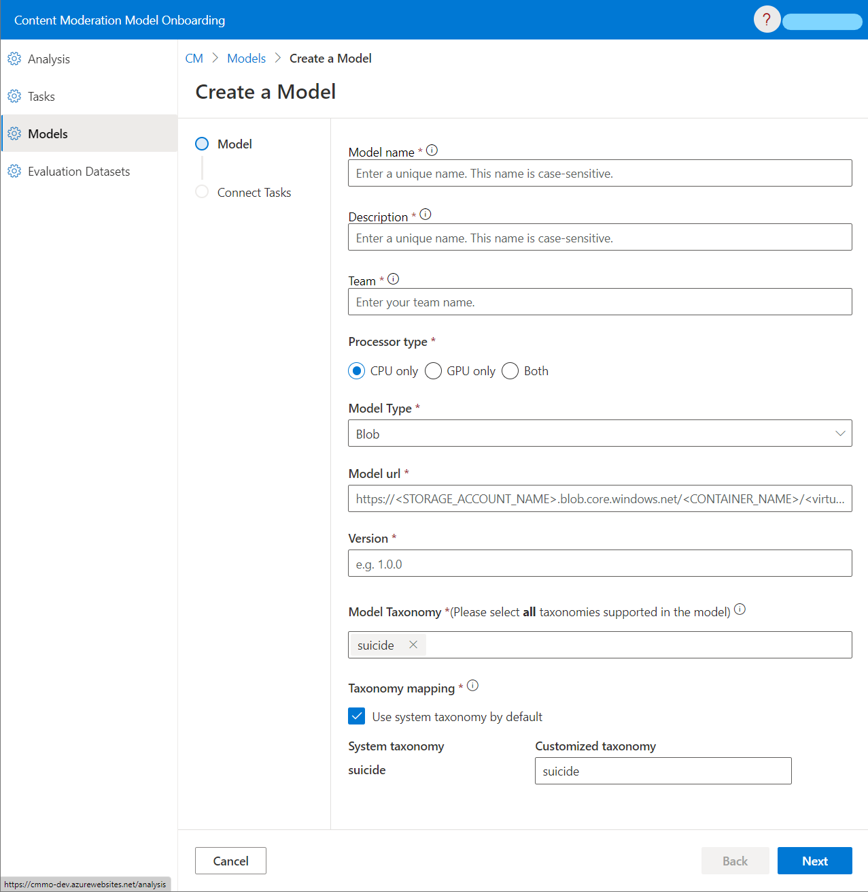

# Model Onboarding Pipeline (MOP) User Guide


> **Note:** This document is a work in progress. Please feel free to contribute to it by submitting a pull request.

[toc]

## Overview
(TBD) This page shows the steps to onboard a model or upload a dataset to the Content Moderation Model Onboarding Pipeline (MOP).   

A **MODEL** in MOP normally contains all necessary files to run an inference, usually including environment setup configuration, model checkpoints, scripts to load the checkpoint files, and other dependencies.

A **DATASET** in MOP is a binary classification dataset, including a data file and a label file.

## Upload a Model
### Prerequisites
- An Azure Storage Account.
### Prepare Your Model
You should prepare your model checkpoint file(s), dependencies and loading script in a Blob Container as below:
```
<Your Model Name>
│
└───model               # Required
│   │   model_ckpt.onnx
│   │   model_ckpt.pkl
│   │   ...
│
│───privatepkgs         # Optional
│   │   privatepkg1.whl
│   │   privatepkg2.whl
│   │   ...
│   
└───src
    │   inference.py        # Required
    │   requirements.txt    # Required
    │   settings.yml         # Optional
```
There are three folders, each of which contains different types of files that will be used for model evaluation.
- **model**: This folder contains the model checkpoint files. The model checkpoint files can be in any format. The model checkpoint files will be used to run the model evaluation.
- **privatepkgs**: This folder contains the private packages that are required to run the model evaluation. The private packages should be in the format of .whl. Notice that private package should not be inluded in **requirements.txt**.
- **src**: This folder contains the scripts that are required to run the model evaluation. The scripts will be executed to run the model evaluation.
    - **inference.py (required)**: This script is used to load the model checkpoint files and run the model evaluation. Install this package https://pypi.org/project/mop-utils/1.0/ source code can be found [here](https://github.com/Azure/carnegie-mop/tree/main/packages) and inherit the `BaseModelWrapper` class and implement the `init`, `inference` and `inference_batch` methods.
    - **requirements.txt (required)**: This file contains the required packages that are used to run the model evaluation. 
  The required packages will be installed before running the model evaluation. If required packages are private packages, they should be uploaded in the `privatepkgs` folder.
    - **settings.yml (optional)**: This file contains the environment setup configuration that is used to run the model evaluation. 
  The environment setup configuration should be in the format of .yml.
  It supports following settings:
      - `dynamicBatch.enable`: Whether to enable dynamic batch. Default is false.
      - `dynamicBatch.maxBatchSize`: The max batch size. Default is 12.
      - `dynamicBatch.idleBatchSize`: The idle batch size. Default is 5. It should be less than or equal to `dynamicBatch.maxBatchSize`.
      - `dynamicBatch.maxBatchInterval`: The max batch interval (in second). Default is 0.002.

For detailed information, please check [the model template](http://xxx) and [the sample model](https://xxxx).

### Grant MOP Access to Your Model
MOP uses Service Principal for authentication. Users should grant the **Storage Blob Data Reader** role to our system (service principal: **cm-model-onboarding-prod-sp**). 
See [Azure RBAC documentation](https://learn.microsoft.com/en-us/azure/role-based-access-control/conditions-role-assignments-portal) for details.

### Onboard Your Model
#### Create a Model on MOP
Go to the MOP portal, click “Models”, fill in information of your model.
- **Model Name**: The name of your model. It should be unique in MOP. **It cannot be changed after the model is created.**
- **Model Description**: The description of your model. **It cannot be changed after the model is created.**
- **Team**: The team that owns the model. **It cannot be changed after the model is created.**
- **Processor Type**: The processor type of your model. It should be one of the following values:
  - `CPU only`: The model is running on CPU.
  - `GPU only`: The model is running on GPU.
  - `Both`: The model is running on both CPU and GPU.
- **Model Type**: The model type of your model. It should be one of the following values:
  - `Blob`: The model is stored in a Azure Blob Container.
- **Model url**: the url of virtual directory in your container that contains those three “folders” mentioned in Prepare Your Model section. 
_For example: https://myTestStorageAccount.blob.core.windows.net/myTestContainer/myTestModel/_
- **Version**: The version of your model. It should be unique for this model in MOP.
- **Model Taxonomy**: All supported taxonomies of the model. **This setting cannot be changed after the model is created.**
- **Taxonomy Mapping**: The mapping between the system-defined taxonomy and the model output. **This setting cannot be changed after the model is created.**


#### Connect Your Models to One or More Tasks
Any time after model creation, you can connect your model to one or more tasks. Only models that are connected to a task can be used to evaluated by MOP.
If you cannot find a proper task, please contact the MOP team and we will help you with it.

#### Update Your Model
You can update your model by creating a new version of the model. Go to the MOP portal, click “Models”, click the model you want to update, click “Upgrade Version”, fill in information of your model.
- **Processor Type**: The processor type of your model.
- **Model Type**: The model type of your model.
- **Model url**: the url of virtual directory in your container that contains those three “folders” mentioned in Prepare Your Model section.
- **Version**: The version of your model. It should be unique for this model in MOP.

## Upload a Dataset
### Prerequisites
- An Azure Storage Account.
### Prepare Your Dataset
You should prepare your dataset in a Blob Container as below:
```
<Your Dataset Name>
│
└───data          
│   │   dataset.csv     # Required
│
│───label         
│   │   label.csv       # Required

```
For different modalities, we have different format requirements for these files.
#### Text
- **dataset.csv**:
  - Encoded using UTF-8 with no BOM (Byte Order Mark).
  - Only one column with the header "text".
  - Each row (except for the header) should be a sample text.
  - The number of rows in dataset.csv should be the same as label.csv.
  - Using “,” as delimiter.
- **label.csv**:
  - Encoded using UTF-8 with no BOM (Byte Order Mark).
  - Only one column with the header "label".
  - Each row (except for the header) should be the corresponding label of the sample in dataset.csv.
  - The number of rows in dataset.csv should be the same as label.csv.
  - Using “,” as delimiter.
  - The label should be one of the following values:
    - `0`: The sample is negative.
    - `1`: The sample is positive.

#### Image
- **dataset.csv**:
  - Four columns with headers "base64_image", "file_name", "image_width_pixels", "image_height_pixels".
  - The content of column "base64_image" should be the base64 encoded string of the image.
  - The content of column " file_name " should include file name extension.
  - The content of column "image_width_pixels" and "image_height_pixels" should be positive integer.
  - Each row (except for the header) should be a sample encoded using UTF-8 with no BOM (Byte Order Mark).
  - The number of rows in dataset.csv should be the same as label.csv.
  - Using “,” as delimiter.
- **label.csv**:
  - Encoded using UTF-8 with no BOM (Byte Order Mark).
  - Only one column with the header "label".
  - Each row (except for the header) should be the corresponding label of the sample in dataset.csv.
  - The number of rows in dataset.csv should be the same as label.csv.
  - Using “,” as delimiter.
  - The label should be one of the following values:
    - `0`: The sample is negative.
    - `1`: The sample is positive.
After preparation, users should save these files in a container under a storage account as organized above.

### Grant MOP Access to Your Dataset
MOP uses Service Principal for authentication. 
Users should grant the **Storage Blob Data Reader** role to our system (service principal: **cm-model-onboarding-prod-sp**). 
See [Azure RBAC documentation](https://learn.microsoft.com/en-us/azure/role-based-access-control/conditions-role-assignments-portal) for details.

### Onboard Your Dataset
#### Create a Dataset on MOP
Go to the MOP portal, click “Evaluation Datasets” -> ”Add a Dataset”, fill in information of your dataset.
- **Dataset Name**: The name of your dataset. It should be unique in MOP. **It cannot be changed after the dataset is created.**
- **Dataset Description**: The description of your dataset. **It cannot be changed after the dataset is created.**
- **Team**: The team that owns the dataset. **It cannot be changed after the dataset is created.**
- **Modality**: The modality of your dataset. It should be one of the following values:
  - `Text`: The dataset is a text dataset.
- **Source Type**: The source type of your dataset. It should be one of the following values:
  - `Blob`: The dataset is stored in a Azure Blob Container.
- **Dataset url**: the url of virtual directory in your container that contains dataset.csv mentioned in Prepare Your Dataset section.
For example: _https://myTestStorageAccount.blob.core.windows.net/myTestContainer/myTestdata/_
- **Label url**: the url of virtual directory in your container that contains label.csv mentioned in Prepare Your Dataset section.
For example: _https://myTestStorageAccount.blob.core.windows.net/myTestContainer/myTestLabel/_

#### Connect Your Dataset to a Task
Any time after dataset upload, you can connect your dataset to a task. 
If you cannot find a proper task, please contact the MOP team, and we will help you with it.
