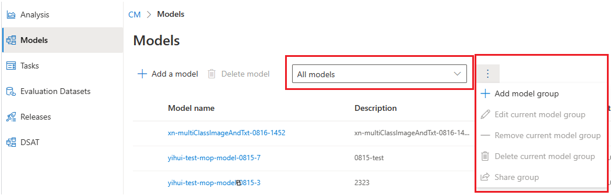

# MOP Model Contributor Guide

MOP can help model owners to manage their model versions, detect vulnerabilities, get various testing results, and release their models to downstream responsible AI services (AACS or RAIO). 

This guide will walk you through the process of onboarding your models to MOP.

## Prerequisites
### Understand MOP Concepts
Please read [MOP Documentation](../README.md) to understand the concepts of MOP.

### Azure Resource
You need an available **Azure Storage Account** to store your model files. If you don't have one, please follow [this guide](https://docs.microsoft.com/en-us/azure/storage/common/storage-account-create?tabs=azure-portal) to create one.

MOP uses Service Principal for authentication. Users should grant the **Storage Blob Data Reader** role to our system (
service principal: **cm-model-onboarding-prod-sp**).
See [Azure RBAC documentation](https://learn.microsoft.com/en-us/azure/role-based-access-control/conditions-role-assignments-portal)

### Prepare Model Files
You should prepare your model checkpoint file(s), dependencies and loading script in a **Blob Container**:

```
<Your Model Folder Name>
│
└───model               # Required
│   │   model_ckpt.onnx
│   │   model_ckpt.pkl
│   │   ...
│
│───privatepkgs         # Optional
│   │   privatepkg1.whl
│   │   privatepkg2.whl
│   │   ...
│   
└───src
    │   inference.py        # Required
    │   requirements.txt    # Required
    │   settings.yml        # Required
```

As listed above, there are three required/optional folders:

#### /model
This folder contains the model checkpoint files. The model checkpoint files can be in any format. The model
  checkpoint files will be used to run the model evaluation.

#### /privatepkgs
This folder contains the private packages that are required to run the model evaluation. The private
  packages should be in the format of .whl. Notice that private package **SHOULD NOT** be included in `requirements.txt`.

#### /src
This folder contains the scripts and configuration files that are required to run the model.
- **inference.py (required)**: This script is used to load the model checkpoint files and run the model evaluation.
  - Install the **mop-util** package: `pip install mop-utils>=2.0` ([source code](../packages/mop_utils))
  - Inherit the `BaseModelWrapper` class from `mop_utils.base_model_wrapper` and implement the following methods:
    - `init`: Load the model checkpoint files.
    - `inference`: Run the model evaluation for a single input.
    - `inference_batch`: Run the model evaluation for a batch of inputs.
    - `convert_model_output_to_mop_output`: Convert the model output to MOP output.
    - `convert_mop_input_to_model_input`: Convert the MOP input to model input.
    - `convert_acs_text_request_to_model_inference_input`: (optional) Convert the ACS text request to model inference input.
    - `convert_model_inference_output_to_acs_text_response`: (optional) Convert the model inference output to ACS text response.
    - `convert_acs_image_request_to_model_inference_input`: (optional) Convert the ACS image request to model inference input.
    - `convert_model_inference_output_to_acs_image_response`: (optional) Convert the model inference output to ACS image response.
  
  >  You may run `inference.py` locally on the environment you created using conda and the dependencies in the requirements.txt.
- **settings.yml (required)**: This file contains the environment setup configuration that is used to run the model evaluation. The environment setup configuration should be in the format of .yml.
  
  It supports following settings:
  - `env.python`: The python version.
  - `env.pip`: The pip version. 
- **requirements.txt (required)**: This file contains the required packages that are used to run the model evaluation. The required packages will be installed before running the model evaluation. If required packages are private packages, they should be uploaded in the `privatepkgs` folder, but do not list them in the requirements.txt.
  > TSG for verifying the requirements.txt locally using Conda:
  > 1. Make sure [Conda](https://conda.io/projects/conda/en/stable/user-guide/install/download.html) is downloaded.
  > 2. Put [tool](verify_conda.bat) on your local directory where `src` and `privatepkgs` folder is put.
  > 3. On windows, in the directory where `verify_conda.bat` located,
      run `./verify_conda.bat environment=<envrionment-name> python=<version> pip=<pip-version>`, for
      example, `./verify_conda.bat mop-env 3.9 23.0.1 `
  > 
  > If you encounter error, you need to fix packages in `requirements.txt` according. For example, there might be some
      package conflict.

For more details, please check [the sample model](./sample/).

## Onboard Your Model
### Create a Model
Go to [MOP portal](https://carnegie-mop.azurewebsites.net), click "Models" on the left navigation bar, and then click "Add a Model" button in the top left corner. 

Fill in the form  in the pop-up window:
* **Model Name**: A unique name of your model. MOP allows letters, numbers, dash and underscore ONLY allows in model name (`[A-Z a-z 0-9 -]`). **This name will be used for model management on MOP and model release to downstream services. It cannot be changed once the model is created**.
* **Description**: A brief description of your model. It can be changed later.
* **Team**: The team that owns the model. **It cannot be changed once the model is created.**
* **Model Type**: The source of the model artifact. Currently, MOP supports **Blob Container** only.
* **Model url**: The url of the model artifact. It should be in the format of `https://<storage-account-name>.blob.core.windows.net/<container-name>/<model-folder-name>`. For example, `https://mopstorage.blob.core.windows.net/mopcontainer/sample_model`. **It cannot be changed once the model is created.**
* **Version**: The version of your model. It should be unique for this model in MOP.
* **Version note**: A brief description of this version. It can be changed later.
* **Sample post data**: The sample data that is used to test the model. It should be in JSON format, and the structure should be consistent with the model input (`BaseModelWrapper.inference()`). For example, `{"text": "This is a sample text."}`. **It cannot be changed once the model is created.**
* **Model configuration**: During the model testing, MOP will deploy your model as a web service and test against it. You can choose the instance (i.e. SKU) that you want to use to run the model evaluation (see [Azure VM Overview](https://learn.microsoft.com/en-us/azure/virtual-machines/sizes) for sku details). 

  Also, there are settings related to the service performance such as Gunicorn thread number, and worker number, dynamic batch settings, .etc. 

  **_These settings will affect the model performance with respect to latency and throughput._** You can tune these settings to achieve the best performance. **It cannot be changed once the model is created.**
  > Gunicorn document:  [workers and threads](https://docs.gunicorn.org/en/stable/design.html#how-many-workers)
  > 
  > Dynamic batch: [pyraisdk document](https://github.com/microsoft/rai-orchestrator/tree/master/pyraisdk#dynamic-batching-support)
* **Connect tasks**: Each model can resolve multiple tasks. You can choose the tasks that this model can resolve in this section. You should follow steps below to specify the tasks your model can resolve:
  1. Select a taxonomy in the taxonomy dropdown list. Only one task can be selected for each taxonomy.
  2. Enter the corresponding name for the selected taxonomy in your model output so that MOP can parse the model output.
  3. Choose a task in the dropdown list. Note that tasks can be different in modalities (i.e. text, image, video, .etc). You need to choose the right task with the right modality.
  4. Add more tasks if needed following steps i-iii.
* **Enable regression test**: MOP will store DSAT cases from (downstream service's) users. These cases are valuable for model quality evaluation and improvement. Each DSAT case will be connected to a task. If you choose to enable regression test, MOP will run the model evaluation against these DSAT cases and report the model performance per task. **It cannot be changed once the model is created.**
  > Only models with regression results can be used for model release.

* **Load test option**: MOP provides two different strategies for load test: adjusting the connection number from client side and adjusting the request per second sent from client side. You can choose one of them based on your requirement. See [Load Test difference](#load-test) for more details.
  
  As for the payload, MOP will use maximum payload for testing, and it cannot be changed, so that the model can be tested with the worst case and the results for different models can be compared. Payload details are different per modality:
    - Text: a piece of text with about 1000 characters.
    - Image: a 224x224 RGB 3-channel JEPG image encoded in base64.
    - ImageAndText: a piece of text with about 2000 characters and a 640*640 RGB 3-channel JEPG image encoded in base64.

## Manage Your Model
### Find Your Model on MOP
Go to [MOP portal](https://carnegie-mop.azurewebsites.net), click "Models" on the left navigation bar. You can see a list of models, including models that you created, and models from others that you have access to view details.

#### Using Model Group
MOP supports model grouping for users to store models that they want to view so that users can easily find models they are interested in. Using the dropdown list and the operation button to manage model groups.



There are two system-defined model group:
- _All models_: All models that you have access to view details.
- _My own models_: All models that you created.

Besides, users can define their model groups. Click ``Add model group`` and create your own model group. You can specify the group name and the individual that you want to share this group.

After model group creation, you can choose the group from the dropdown list on Model list page. Also, you can manage the selected model group (edit/delete/share) using the operation button.

#### Using Status filter
MOP supports model status filter for users to find models that they want to view. Using the dropdown list in the top right corner to filter models by status. The default status is _All except outdated and verifyFailed_. So you may need to change the status filter to view all models.

#### Using Search box
MOP supports model search for users to find models that they want to view. Using the search box in the top right corner to search models by model name.

### Model details
Click the model name to view the model details. There are model information, Taxonomy mapping, model version history and Connected tasks.

#### Model information
Model information includes model name, description, team, model owner and created time. Model owner can edit the model description by clicking the edit button.

#### Taxonomy mapping
Taxonomy mapping shows the mapping between model output and system-defined taxonomy. 

#### Model version history
Model version history shows all versions of this model. You can view the model version details in the table and perform operations on each version.
- Version: The version of the model.
- **Status**: After onboarding a model, MOP will perform a series of verification steps, including deploying it as a web service (via AML MIR), to ensure a model is ready for testing. The _Status_ describes the status of the model version during the process. There are following status:
  - created: The model version is created. It is the initial status.
  - dataDownloaded: MOP has retrieved the model artifact from the model blob url.
  - environmentCreating/environmentCreated/endpointCreating/endpointCreated/deploymentCreating/deploymentCreated: 
    
    MOP will deploy a model as a web service and send test data to see if the service works. These steps are related to the deployment of the model web service.
  - verified: The model version is verified. It means the model is ready for testing.
  - verifyFailed: The model version is failed to verify. It means the model is not ready for testing. You can click the _Details_ button to view the verification result and the reason for failure. Note the details may have multiple pages.
  - vulnerable: The model version is vulnerable. It means the model is not ready for testing. You can click the _Details_ button to view the vulnerability result and the reason for failure.
  - toBeRetried: The model version is failed to verify for non-critical reasons (such as network issue when try to download model artifact). MOP will try to verify it again later.
- Sample post data: The sample data that is used to test the model. It should be in JSON format, and the structure should be consistent with the model input (`BaseModelWrapper.inference()`). **You may edit it if needed.**
- **Instance type**: The SKU(i.e. SKU) that you want to use to run the model evaluation. Please check [Azure VM Overview](https://learn.microsoft.com/en-us/azure/virtual-machines/sizes) for details.
- Logs: The log of model deployment fetched from AML.
- **Load test result**: The result of model load test. MOP will perform the load test according your load test option while onboarding/updating a model. If the model is not ready for testing, the load test result will be shown as `notAvailable`. If you do not enable load test, you can choose to enable it now by clicking the _Enable_ button. When the load test is _finished_, you can click _View details_ to see the load test result.

  For different load test strategies, the x-axis of the load test result chart is different: 
  - PerRPS: target RPS
  - PerConcurrency: the number of concurrent connections
  
  For both strategies, the load test result charts show metrics including:
  - Actual RPS: the actual RPS that the model can handle.
  - Latency: the average latency of the model (average time and percentile time).
  - Request Count: the number of requests that the model can handle (including successful requests and failed requests).
  - Resource utilization: the CPU, GPU (if available on the SKU) and memory usage (%) of the model.
- Model configuration: View the model configuration here when the model revision is created/updated.
- **Publish status**: This field shows whether this model revision can be seen by other users. Model owners can change this options.
  - private: Only model owners can see this model revision, and its evaluation metrics.
  - public: All users can see this model revision, and its evaluation metrics. 
  > Note: Only public models can be used for model release.

- Version note: The note of this model version. Model owners can edit the note by clicking the edit button. 
- Model URL: The Blob url of the model artifact. 
- Created time: The time when this model version is created.
- Created by: The user who created this model version.
- Model revision id: The id of this model version. It is the unique identifier of this model version in MOP system.

### Connected tasks
Connected tasks shows all tasks that are connected to this model. You can view the task details in the table and perform operations on each task. Model owner can choose add more tasks to this model by clicking the _Add task_ button, or remove tasks from this model by clicking the _Disconnect task_ button in Model details page.

### Update/Delete Model
Model owner can update/delete the model on MOP portal.

#### Update Model
Go to Model detail -> Model history, anc click _Upgrade version_ button. 

You can update the model configuration, regression test option, load test option, model url, version, version note and sample post data in the update model page. Other fields are read-only.

#### Delete Model version
Go to Model detail -> Model history. Select the model version that you want to delete, and click the _Delete version_ button. If you delete a model version, all testing results of this model version will be deleted as well.

#### Delete Model
In Model list page, select the model that you want to delete and click the _Delete model_ button. If you delete a model, all testing results of all versions of this model will be deleted as well.

## Model Testing results
See [Model Testing results](./doc/ModelTestingResults.md).