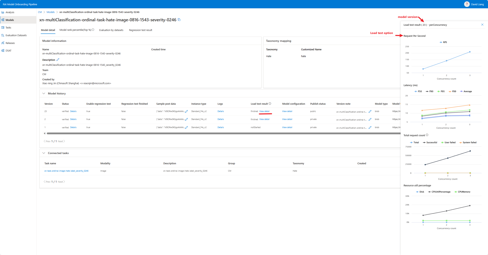

# Model Testing Results Handbook

MOP performs various offline testing on models to help MOP users to better understand the models' performance on quality, robustness and throughput.

**Normal users can view testing results for all public models. Model owners can also view testing results for their own public and private models.**

Users may want to check/compare testing results from different angles. For example, they may want to check the testing results of a model on different tasks, or check the testing results of different models on the same task. MOP provides a flexible way to filter testing results based on different criteria.

## From a model perspective
Based on the model testing option, MOP will perform load testing, evaluation testing and regression testing **in order**.

### Load testing
If a model owner choose to enable load testing while onboard/update the model, MOP will perform load testing on the model. The load testing result will be shown in the model version history page.

As for the payload, MOP will use maximum payload for testing, and it cannot be changed, so that the model can be tested with the worst case and the results for different models can be compared. Payload details are different per modality:
- Text: a piece of text with about 1000 characters.
- Image: a 224x224 RGB 3-channel JEPG image encoded in base64.
- ImageAndText: a piece of text with about 2000 characters and a 640*640 RGB 3-channel JEPG image encoded in base64.

### Evaluation testing
MOP will perform evaluation testing on the model. Evaluation datasets are chosen from the Task that your model connects to. The evaluation testing result will be shown in the _Evaluation by datasets_ page.

The Evaluation by datasets page shows the evaluation result of each dataset on each version. You can use the dropdown list in the top right corner to select the Task and the model version.

For categorical tasks, you can choose averaging methods and the page will show the corresponding evaluation metrics. 
- Macro-averaging: Calculate metrics using arithmetic mean of the metrics of all labels.
- Micro-averaging: Calculate metrics globally by counting the total true positives, false negatives and false positives for all labels.
- Weighted-averaging: Calculate metrics for each label, and find their average weighted by support (the number of true instances for each label). This alters ‘macro’ to account for label imbalance; it can result in an F-score that is not between precision and recall.

For ordinal tasks, the evaluation metrics will be **the one for the best label partition**, which gives the highest F1 score.

For each evaluation result, you can click _Details_ button to see the **confusion matrix and the classification report** in details. Besides, for categorical tasks, you can merge labels and see the evaluation result after merging.

Open _Comparison mode_ on the top of the page, you can **put several records together** on the top of the page and compare them. 

Click column header of evaluation metrics, you can **sort the records** by the metrics.

### Regression Testing
(TBD)

### Golden Set Testing
(TBD)

## From a task perspective
> In Task tab, **all users will only see public model revisions and their results**.

In Task detail page, you can check the testing results for all evaluation datasets that connect to this task. 

In the `Task -> Task detail -> Evaluation by datasets` page, MOP will list the best model according the best metric filter (both categorical and ordinal tasks), and the aggregation method (ordinal task only) you choose for each dataset. You can also see the detailed results by clicking the `Details` button on the right side of each record.

Sorting by specific metrics, comparison mode are also supported in this page.

## From a dataset perspective
> In Evaluation Dataset tab, **all users will only see public model revisions and their results**.

In Evaluation Dataset detail page, you can check the testing results for all models that connect to (indirectly, via tasks) this dataset.

Use dropdown list in the top right corner to select the task.

For binary datasets, MOP lists every record from all models and their public versions associated with that dataset. Each record displays metrics derived from the label partition that yielded the highest F1 score.

For multi-label datasets, MOP lists every record from all models and their public versions associated with that dataset. Each record displays average metrics according to the aggregation method you choose in the top right corner of the page.