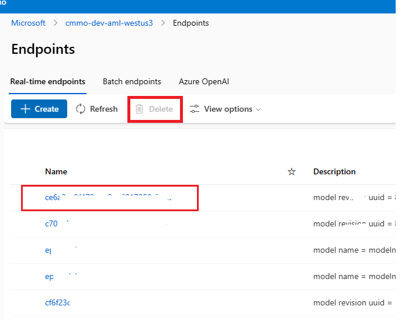

# AML Endpoint Creating troubleshooting

## 1. InferencingClientCallFailed
### A simplified description might resemble the following:
```json
(BadRequest) The request is invalid. Code: BadRequest Message: The request is invalid. Exception Details: (InferencingClientCallFailed) {
    {
        "errors": {
            {
                "": [
                    "Specified endpoint [c21029a9f98043379fd84f95d8180699] has not been created successfully. Please recreate the endpoint."
                ]
            }
        },
        "title": "One or more validation errors occurred."
    }
}Code: InferencingClientCallFailed Message: {
    {
        "errors": {
            {
                "": [
                    "Specified endpoint [c21029a9f98043379fd84f95d8180699] has not been created successfully. Please recreate the endpoint."
                ]
            }
        },
        "title": "One or more validation errors occurred."
    }
}Additional Information:Type: ComponentName Info: {
    "value": "managementfrontend"
}Type: Correlation Info: {
    "value": {
        "operation": "2e2b47e238f198219f2ce873289ca5de",
        "request": "494706390cd62239"
    }
}Type: Environment Info: {
    "value": "westus3"
}Type: Location Info: {
    "value": "westus3"
}Type: Time Info: {
    "value": "2023-06-14T00:56:45.4353068+00:00"
}
```

### Take appropriate action:
- Examine the AML online endpoint logs to identify any errors, and then take appropriate actions based on the error.

 
- Verify whether the instance (CPU/GPU) quota has been exceeded, and remove any unnecessary models.  
    
- Assess if it's necessary to remove role assignments.
- Consider re-onboarding or upgrading the model.
