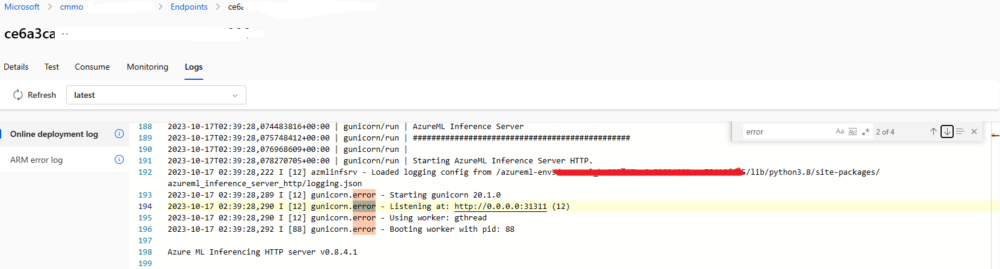
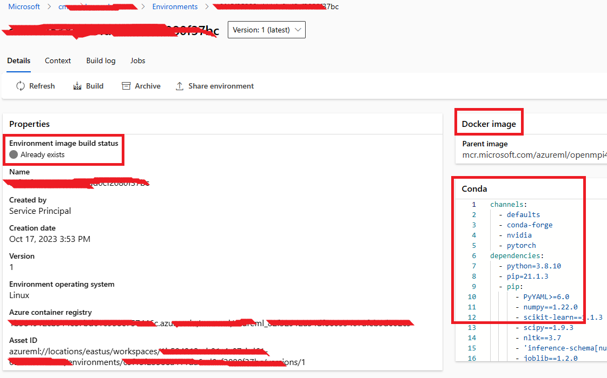
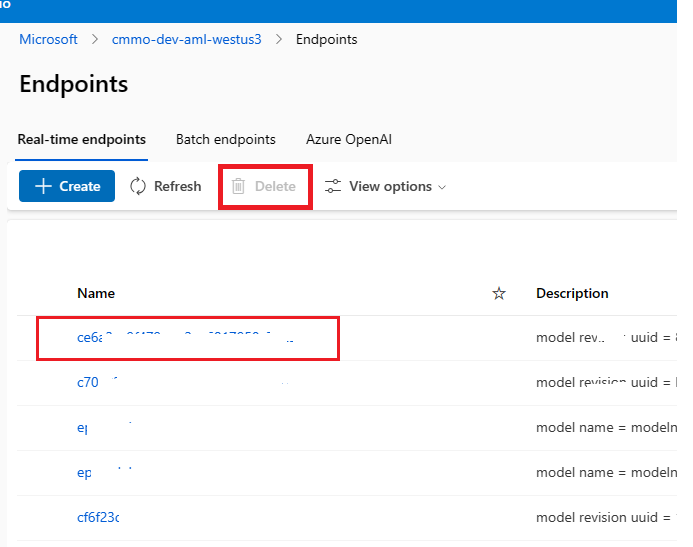
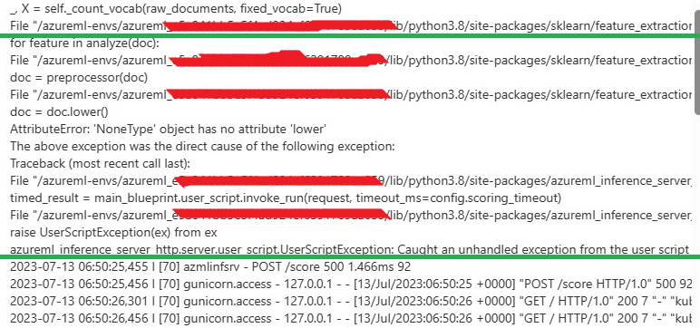

# AML Endpoint Deployment troubleshooting

## 1. InferencingClientCallFailed
### A simplified description might resemble the following:
```json
(BadRequest) The request is invalid. Code: BadRequest Message: The request is invalid.  
Exception Details: (InferencingClientCallFailed) {
    {
        "errors": {
            {
                "": [
                    "Specified deployment [latest] failed during initial provisioning and is in an unrecoverable state. Delete and re-create."
                ]
            }
        },
        "title": "One or more validation errors occurred."
    }
} Code: InferencingClientCallFailed Message: {
    {
        "errors": {
            {
                "": [
                    "Specified deployment [latest] failed during initial provisioning and is in an unrecoverable state. Delete and re-create."
                ]
            }
        },
        "title": "One or more validation errors occurred."
    }
} Additional Information:Type: ComponentName Info: {
    "value": "managementfrontend"
}Type: Correlation Info: {
    "value": {
        "operation": "92ac12c5481e7f3666f4db7e47faf45e",
        "request": "273525a17208f0f6"
    }
}Type: Environment Info: {
    "value": "eastus"
}Type: Location Info: {
    "value": "eastus"
}Type: Time Info: {
    "value": "2023-03-16T11:10:13.0172602+00:00"
}
```

### Take appropriate action:
- Review the AML deployment log:
    Access the AML deployment log, search for errors, and examine the detailed error information. Take appropriate actions as outlined below: 
    
 
- Examine the AML environment log:
    Navigate to the AML environment page and open the 'Details' tab to access detailed model environment information, or refer to the "Build log" tab to review environment build logs.
    
 
- Verify if CPU/GPU instance quotas have been exceeded, and remove any redundant models.  
    
    
- Consider re-onboarding or upgrading the model.

## 2. UserScriptException
### A simplified description might resemble the following:
```bash
doc = doc.lower() 
AttributeError: 'NoneType' object has no attribute 'lower' 
The above exception was the direct cause of the following exception: 
Traceback (most recent call last): 
File "/azureml-envs/azureml_e5a841bb5e5f4ad924ef6391789aa059/lib/python3.8/site-packages/azureml_inference_server 
timed_result = main_blueprint.user_script.invoke_run(request, timeout_ms=config.scoring_timeout) 
File "/azureml-envs/azureml_e5a841bb5e5f4ad924ef6391789aa059/lib/python3.8/site-packages/azureml_inference_server 
raise UserScriptException(ex) from ex 
azureml 
inference server http.server.userscrit.UserScritExcetion: Caught an unhandled excetion from the user script
```


### Take appropriate action:
- Examine your deployment log on the portal under **"Logs -> Details"** for more information. Search for the keyword **"error/fail"** to locate error details, and subsequently make necessary code changes in your **inference.py** to resolve the issue causing the AML endpoint deployment failure. Following this, consider re-onboarding or upgrading the model.
