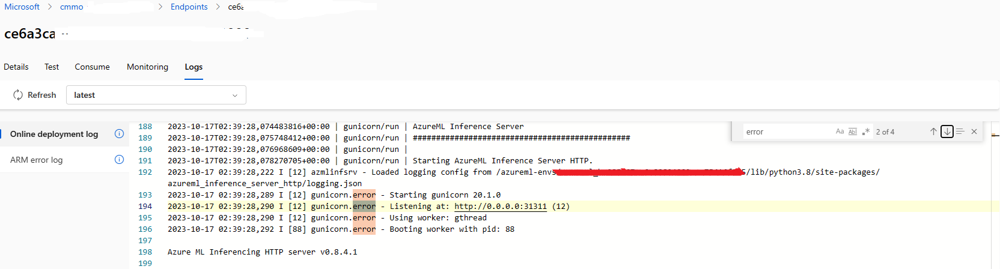

# Environment conda troubleshooting

## 1. CondaDependencyError
### A simplified description might resemble the following:
```bash
Step 8/21 : RUN ldconfig /usr/local/cuda/lib64/stubs && conda env create -p /azureml-envs/azureml_e57c376e843ed0524af2f71285901817 -f azureml-environment-setup/mutated_conda_dependencies.yml && rm -rf "$HOME/.cache/pip" && conda clean -aqy && CONDA_ROOT_DIR=$(conda info --root) && rm -rf "$CONDA_ROOT_DIR/pkgs" && find "$CONDA_ROOT_DIR" -type d -name __pycache__ -exec rm -rf {} + && ldconfig
---> Running in 4de347f830e7
/opt/miniconda/bin/python: /opt/miniconda/bin/../lib/./libtinfow.so.6: no version information available (required by /opt/miniconda/bin/../lib/libpypy3-c.so)
/opt/miniconda/bin/python: /opt/miniconda/bin/../lib/./libtinfow.so.6: no version information available (required by /opt/miniconda/bin/../lib/libpypy3-c.so)
Retrieving notices: ...working... done
Collecting package metadata (repodata.json): ...working... /opt/miniconda/bin/python: /opt/miniconda/bin/../lib/./libtinfow.so.6: no version information available (required by /opt/miniconda/bin/../lib/libpypy3-c.so)
/opt/miniconda/bin/python: /opt/miniconda/bin/../lib/./libtinfow.so.6: no version information available (required by /opt/miniconda/bin/../lib/libpypy3-c.so)

done
Solving environment: ...working... WARNING conda.resolve:_get_sat_solver_cls(70): Could not run SAT solver through interface 'pycosat'.
failed

CondaDependencyError: Cannot run solver. No functioning SAT implementations available.

The command '/bin/sh -c ldconfig /usr/local/cuda/lib64/stubs && conda env create -p /azureml-envs/azureml_e57c376e843ed0524af2f71285901817 -f azureml-environment-setup/mutated_conda_dependencies.yml && rm -rf "$HOME/.cache/pip" && conda clean -aqy && CONDA_ROOT_DIR=$(conda info --root) && rm -rf "$CONDA_ROOT_DIR/pkgs" && find "$CONDA_ROOT_DIR" -type d -name __pycache__ -exec rm -rf {} + && ldconfig' returned a non-zero code: 1
2023/06/21 07:29:25 Container failed during run: acb_step_0. No retries remaining.
failed to run step ID: acb_step_0: exit status 1

Run ID: cap5 failed after 3m57s. Error: failed during run, err: exit status 1
```

### Take action:
- Check if Docker image has issue or not. If so, use another Docker image and retry onboarding model or upgrade model.
- Check AML image build log to see if encountered error or not: open <uuid>.txt to see details.
 

## 2. CondaEnvException
### A simplified description might resemble the following:
```bash
Downloading mop_utils-1.8-py3-none-any.whl (4.4 k8) 
0[91 mPip subprocess error: 
ERROR: Could not find a version that satisfies the requirement numpy==5.22.0 (from versions: 1.3.O, 1.4.1, l.s.o, 1.5.1, 1.6.C 
ERROR: No matching distribution found for 
CondaEnvException: Pip failed 
2023/06/26 03:34:48 Container failed during run: acb_step_O. No retries remaining. 
failed to run step ID: acb_step_O: exit status 1 
Run ID: ca3b6 failed after 2m19s. Error. failed during run, err: exit status 1 
ev 1 / 6 Next) 
```

### Take action:
- Check AML deployment log:   
    Open AML deployment log, and search error to find its details error, and take relative action like below:  
    
 
- Check AML image build log to see if encountered error or not: open <uuid>.txt to see details.
  
 
- Check AML image build log for details:   
   Refer to [Image build failure](https://learn.microsoft.com/en-us/azure/machine-learning/how-to-troubleshoot-online-endpoints?view=azureml-api-2&tabs=python#error-imagebuildfailure)  
- Re-onboarding or upgrade model.

