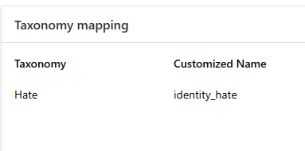

# Model Taxonomy

## 1. TaxonomyMisMatchError
### simple details description may like below:
```html
Taxonomy=<taxonomy> not returned. model_revision_uuid = <model_revision_uuid>
```
### Take action:
- Check if taxonomy match taxonomies response:
For example: Taxonomy need match identity_hate in API /score response.

Taxonomy mapping may look as below:  
